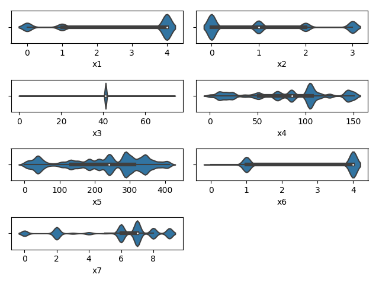
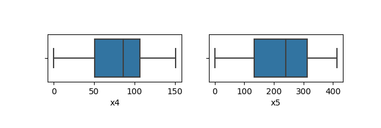
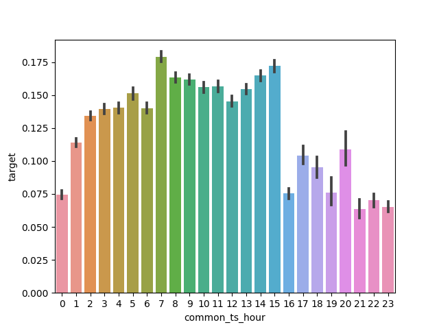
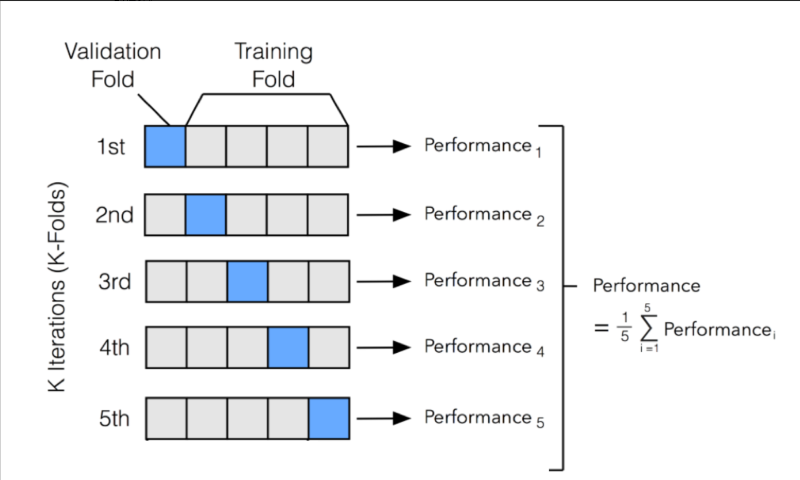
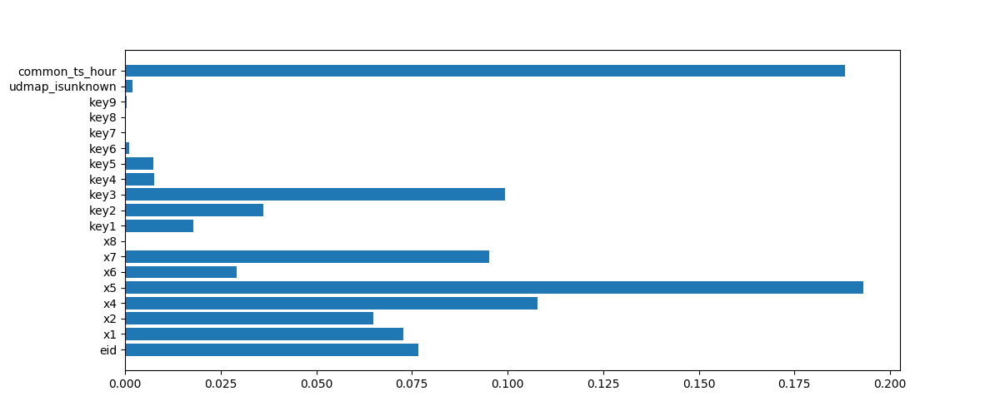

# Task2


## 2.1 数据分析与数据可视化

数据探索性分析，是通过了解数据集，了解变量间的相互关系以及变量与预测值之间的关系，对已有数据在尽量少的先验假设下通过作图、制表、方程拟合、计算特征量等手段探索数据的结构和规律的一种数据分析方法，从而帮助我们后期更好地进行特征工程和建立模型，是机器学习中十分重要的一步。


```python
# 导入库
import pandas as pd
import numpy as np
import matplotlib.pyplot as plt
import seaborn as sns

# 读取训练集和测试集文件
train_data = pd.read_csv('用户新增预测挑战赛公开数据/train.csv')
test_data = pd.read_csv('用户新增预测挑战赛公开数据/test.csv')

# 相关性热力图
sns.heatmap(train_data.corr().abs(), cmap='YlOrRd')

# x7分组下标签均值
sns.barplot(x='x7', y='target', data=train_data)
```


==seaborn==库是基于Matplotlib产生的一个模块，专攻统计可视化，可以和Pandas进行无缝链接。


`heatmap()`函数用于绘制热力图，可以展示数值大小的相对关系。


`seaborn`的`barplot()`利用矩阵条的高度反映数值变量的**集中趋势**，以及使用`errorbar`功能（差棒图）来估计变量之间的差值统计。它展示的是某种分布的**平均值**。

在这里，它展示了`keymap`中`x7`在不同取值下的`target`标签的分布。横坐标展示了`x7`的不同取值，纵坐标展示了不同取值下`target`标签平均值。


**T1  字段x1至x8为用户相关的属性，为匿名处理字段。添加代码对这些数据字段的取值分析，那些字段为数值类型？那些字段为类别类型？**

首先，绘制这些字段的取值分布图，实现代码如下

```python
plt.subplot(421)
sns.violinplot("x1", data=train_data)

plt.subplot(422)
sns.violinplot("x2", data=train_data)

plt.subplot(423)
sns.violinplot("x3", data=train_data)

plt.subplot(424)
sns.violinplot("x4", data=train_data)

plt.subplot(425)
sns.violinplot("x5", data=train_data)

plt.subplot(426)
sns.violinplot("x6", data=train_data)

plt.subplot(427)
sns.violinplot("x7", data=train_data)

plt.tight_layout()
plt.savefig("violin.png")
plt.show()
```

结果如下



可以得到如下结论：

	- x1, x2, x6, x7标签的取值均为若干离散整数值，可以认为它们是类别类型
	- x4,x5标签的取值覆盖范围较大，可以认为它们是数值类型
	- x3的取值只有一个，所以此处无法研究x3产生的影响


**T2  对于数值类型的字段，考虑绘制在标签分组下的箱线图。**

```python
plt.subplot(421)
sns.boxplot("x4", data=train_data)

plt.subplot(422)
sns.boxplot("x5", data=train_data)

plt.savefig("boxplot.png")
plt.show()
```

得到的结果如下：




**T3  从common_ts中提取小时，绘制每小时下标签分布的变化。**

```python
sns.barplot(x="common_ts_hour", y="target", data=train_data)
plt.savefig("hour.png")
plt.show()
```

得到的结果如下：



可以得到的结论是：从8点到15点新增用户居多，从16点到0点新增用户较少。


## 2.2 模型交叉验证

交叉验证（Cross-Validation）是机器学习中常用的一种模型评估方法，用于评估模型的性能和泛化能力。它的主要目的是在有限的数据集上，尽可能充分地利用数据来评估模型，避免过拟合或欠拟合，并提供对模型性能的更稳健的估计。

交叉验证的基本思想是将原始的训练数据划分为多个子集（也称为折叠），然后将模型训练和验证进行多次循环。在每一次循环中，使用其中一个子集作为验证集，其他子集作为训练集。这样可以多次计算模型的性能指标，并取这些指标的平均值作为最终的模型性能评估结果。




首先导入必要的库

```python
# 导入模型
from sklearn.linear_model import SGDClassifier
from sklearn.tree import DecisionTreeClassifier
from sklearn.naive_bayes import MultinomialNB
from sklearn.ensemble import RandomForestClassifier

# 导入交叉验证和评价指标
from sklearn.model_selection import cross_val_predict
from sklearn.metrics import classification_report
```


接着选择模型进行训练

```python
pred = cross_val_predict(
    SGDClassifier(max_iter=10),
    train_data.drop(['udmap', 'common_ts', 'uuid', 'target'], axis=1),
    train_data['target']
)
print(classification_report(train_data['target'], pred, digits=3))
```

|              | precision | recall | f1-score | support |
| ------------ | --------- | ------ | -------- | ------- |
| 0            | 0.867     | 0.922  | 0.894    | 533155  |
| 1            | 0.223     | 0.137  | 0.170    | 87201   |
| accuracy     |           |        | 0.811    | 620356  |
| macro avg    | 0.545     | 0.530  | 0.532    | 620356  |
| weighted avg | 0.777     | 0.811  | 0.792    | 620356  |

其中macro-f1是针对于每个类计算精确率和召回率，求平均，然后再按照F1-score公式计算即可。
$$
precision_{ma}=\frac{precision_1+precision_2+precision_3}{3} \\
recall_{ma}=\frac{recall_1+recall_2+recall_3}{3} \\
F_{1,ma}=2\frac{recall_{ma}\times precision_{ma}}{recall_{ma}+precision_{ma}}\
$$
此处，SGD模型的macro-f1的值为0.532.


```python
# 训练并验证DecisionTreeClassifier
pred = cross_val_predict(
    DecisionTreeClassifier(),
    train_data.drop(['udmap', 'common_ts', 'uuid', 'target', 'x3'], axis=1),
    train_data['target']
)
print(classification_report(train_data['target'], pred, digits=3))
```

决策树的macro-f1的值为0.771.


```python
# 训练并验证MultinomialNB
pred = cross_val_predict(
    MultinomialNB(),
    train_data.drop(['udmap', 'common_ts', 'uuid', 'target', 'x3'], axis=1),
    train_data['target']
)
print(classification_report(train_data['target'], pred, digits=3))
```

朴素贝叶斯的macro-f1的值为0.550.


```python
# 训练并验证RandomForestClassifier
pred = cross_val_predict(
    RandomForestClassifier(n_estimators=5),
    train_data.drop(['udmap', 'common_ts', 'uuid', 'target', 'x3'], axis=1),
    train_data['target']
)
print(classification_report(train_data['target'], pred, digits=3))
```

随机森林的macro-f1的值为0.752


通过以下代码可以得到决策树中起重要作用的变量

```python
import matplotlib.pyplot as plt
lst = train_data.columns.values.tolist()
del lst[0]
del lst[1]
del lst[1]
del lst[3]
del lst[8]
print(lst)
plt.figure(figsize=(5, 5))
plt.barh(range(len(clf.feature_importances_)), clf.feature_importances_,align='center', tick_label=lst)
plt.savefig("tree.png")
plt.show()
```

得到的结果为



可以得到的结论是：x5, common_ts_hour,  key3, x4, x7起的作用较大；x8, key7, key8, key9几乎不起作用


## 2.3 特征工程

特征工程指的是把原始数据转变为模型训练数据的过程，目的是获取更好的训练数据特征。特征工程能使得模型的性能得到提升，有时甚至在简单的模型上也能取得不错的效果。


特征工程的实现可以通过对于不同特征的**排列组合**得到，例如计算频次，平均数，多特征的组合。


```python
train_data['common_ts_day'] = train_data['common_ts'].dt.day
test_data['common_ts_day'] = test_data['common_ts'].dt.day
```

此代码可以将日期中的天数提取出来，成为一个新的特征。


```python
train_data['x1_freq'] = train_data['x1'].map(train_data['x1'].value_counts())
test_data['x1_freq'] = test_data['x1'].map(train_data['x1'].value_counts())
train_data['x1_mean'] = train_data['x1'].map(train_data.groupby('x1')['target'].mean())
test_data['x1_mean'] = test_data['x1'].map(train_data.groupby('x1')['target'].mean())
```

此代码可以将数据按照某个指标进行分组，并且计算每个分组中的均值和频数。